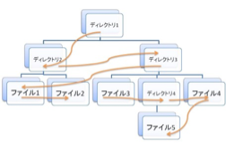
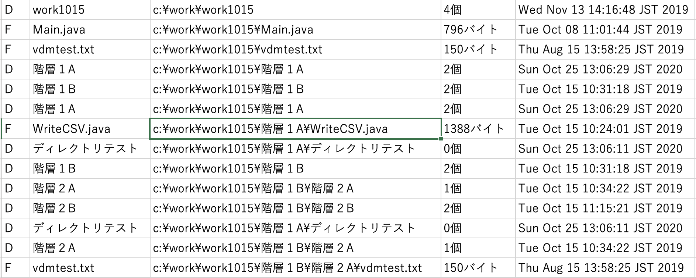
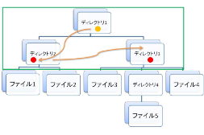
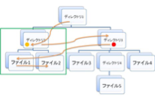
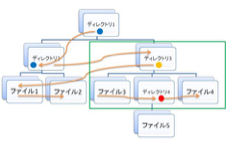
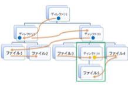
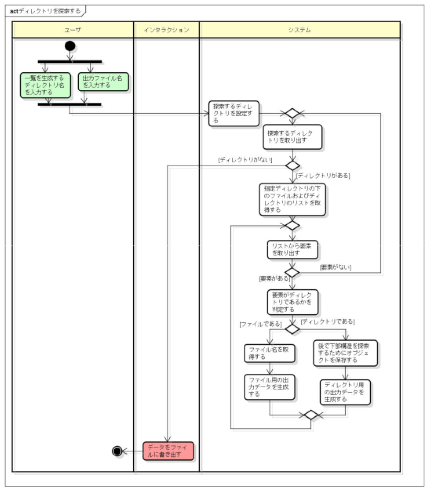

# プログラミング演習II テーマ1

## 学習のポイント

* ディレクトリ操作
* 木構造の探索
* キーボードからの入力
* 入力エラーチェック
* ファイルへの書き込み
* データの出力形式への変換

## 設計のポイント
* データ構造
* 処理の順序
* ライブラリの理解

## 1. 以下の条件を満たすように、ファイルの一覧データを生成し、ファイルに書き出すプログラムを定義しなさい。
1. キーボードから「一覧を生成するディレクトリ名」と「出力ファイル名」を入力する。
2. 一覧は指定したディレクトリ名をルートとする木構造を幅優先の順序で探索し、各ディレクトリの構成要素を表示する。



3. 出力は、以下に示す様な形式のテキストファイルとする。ディレクトリ名とそのディレクトリ下に格納されているファイル及びディレクトリの名称及び種類がわかる形式であればよい。ファイルの拡張子はtxt である。

```text
Directory: ディレクトリ1
    ディレクトリ2はディレクトリです。
    ディレクトリ3はディレクトリです。
Directory: ディレクトリ2
    ファイル1はファイルです。
    ファイル2はファイルです。
Directory: ディレクトリ3
    ファイル3はファイルです。
    ディレクトリ4はディレクトリです。
    ファイル4はファイルです。
Directory: ディレクトリ4
    ファイル5はファイルです。
```

## 2.	1. のプログラムの出力形式を変更し、以下のようにデータをCSV 形式のファイルに出力しなさい。ファイルの拡張子はcsv である。

出力データには以下の項目を含むこと。
* ディレクトリまたはファイルの種別（D とF）
* ファイルの場合はファイル名・ファイルの絶対パス・サイズ・更新日時
* ディレクトリの場合はディレクトリ名・含まれるファイルまたはディレクトリ数
※CSV(Comma Separated Values) カンマ区切り



## 補足

ヒント：
Java のAPI を調べる。

java.io.File クラスを調べる。

指定したdirname でディレクトリの一覧を求めるには
```java
File dir = new File(dirname);
String[] dirlist = dir.list();
または
File[] dirlist = dir.listFiles();
```
であるが、得られるオブジェクトの型が違うので注意する。

また、オブジェクトがディレクトリであるか否かを判定するメソッドはisDirectory() である。
（これは File 型オブジェクトに適用することができる）

### ステップ1

File クラスを使えるようになる。
固定のディレクトリ名でファイルデータを取得する方法を調べる。上記のlist()やlistFiles()のメソッドで何が取得できるかをプログラムを書いて確認しましょう。

※File("src")の引数”src”はこのプログラムを実行するディレクトリから見えるディレクトリのパスを指定する必要があります。この名前が適切でないとNullPointerExceptiom というエラーになります。File dir = new File("src"); においてnew できなかったため、dir がnull ということです。

サンプルプログラム
```java
import java.io.File;
public class FileTest{
    public static void main(String[] args){
        File dir = new File("src");
        /* 文字列として取得 */
        String[] dirlist = dir.list();
        /* File オブジェクトとして取得 */
        File[] dirFilelist = dir.listFiles();
        /* 取得した文字列データを画面出力 */
        for(int i =0; i < dirlist.length; i++){
            System.out.println(dirlist[i]);
        }
        System.out.println("-------------------");
        /* 取得したFile オブジェクトデータを画面出力 */
        for(int i =0; i < dirFilelist.length; i++){
            System.out.println(dirFilelist[i].getName());
        }
    }
}
```

### ステップ2

ディレクトリをたどるとは？
ディレクトリは下記のような木構造になっています。ファイルが「葉」に相当し、それ以上、下部の構造を持ちません。
さて、図の矢印のように探索し、各ディレクトリに含まれる要素を一覧としてデータを作ろうということです。


まず、ディレクトリのルートからはその下部構造を下記のように見ることができます。ここにはデ
ィレクトリが2つあることが判りました。つまりここでの出力すべきデータは
```text
Directory:ディレクトリ1
    ディレクトリ2 はディレクトリです。
    ディレクトリ3 はディレクトリです。
```
となります。



緑の四角形の部分が探索している仕事の範囲です。

このつぎは、ディレクトリ2 の下部構造のデータを生成し、つぎにディレクトリ3 の下部構造を生
成するということです。

下部構造を見ていく仕事の仕方は同じですが、ディレクトリ2 で仕事を先にするので、ディレクト
リ3 ではその後に仕事をすることを覚えておく必要があります。仕事の順序を覚えておき、前の仕事が終わったら、つぎの仕事を行うわけです。以下の図でも緑の四角形で囲われた部分が１つの仕事の単位です。作業は見つけたディレクトリの順序で順番に行っています。見つけたディレクトリには赤い丸印がついています。黄色い丸印が現在仕事をしているディレクトリ、青い丸印が、仕事が終わったディレクトリです。

1



2



3



## ステップ3

全体の処理の流れを考える。UML モデルのアクティビティ図を使ってみる。
この問題の全体の解決フローは図ように考えることができます。
四角形で表されるアクションがプログラムの主な振舞いを表現しています。
（まだメソッド単位にはなっていません。）
矢印が振舞いの流れを表します。
●はプログラムの開始を◉は終了を表しています。
「ユーザ」「インタラクション」「システム」の区切りをパーティションと呼びます。
ユーザの操作はユーザパーティションに、システムからの出力はインタラクションパーティションに、システムの振舞いはシステムパーティションに書かれています。

※図はオブジェクト指向によるソフトウェア開発を行う際に用いられる統一モデリング言語UML(Unified Modeling Language)のアクティビティ図というモデル図です。システム全体の振舞いや、アルゴリズムの分析などにも用います。


